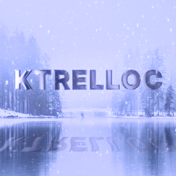
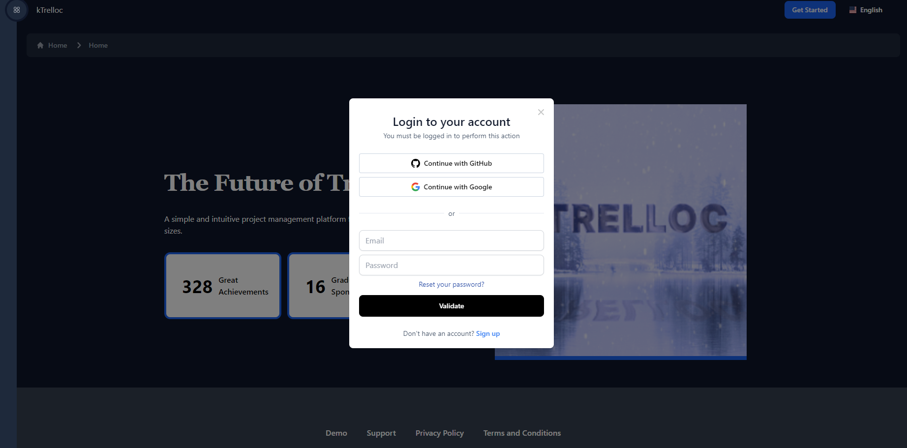
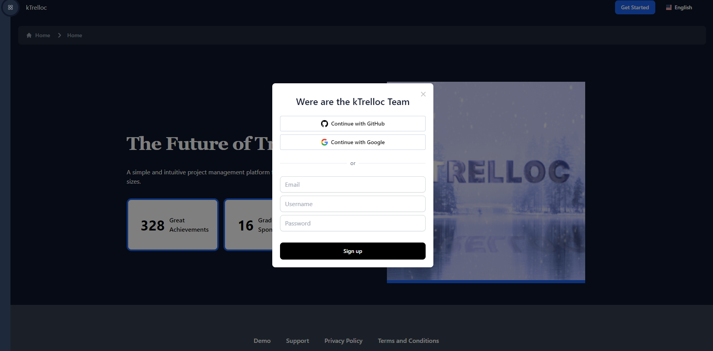
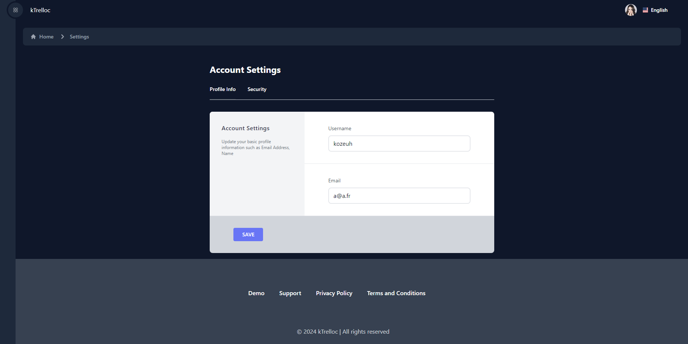
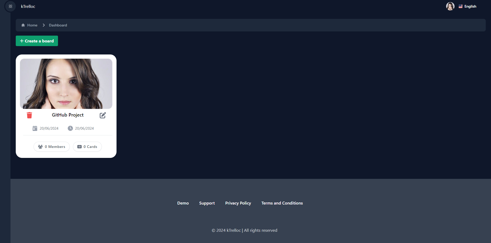
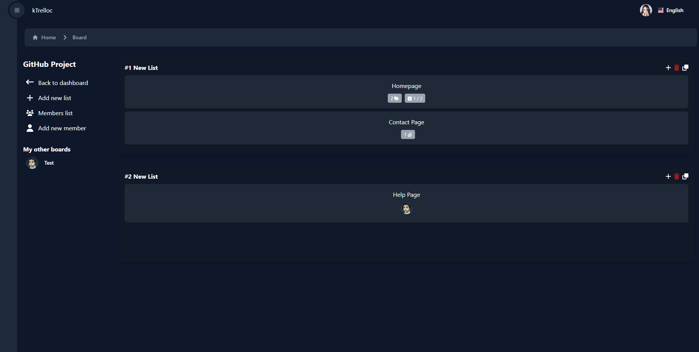
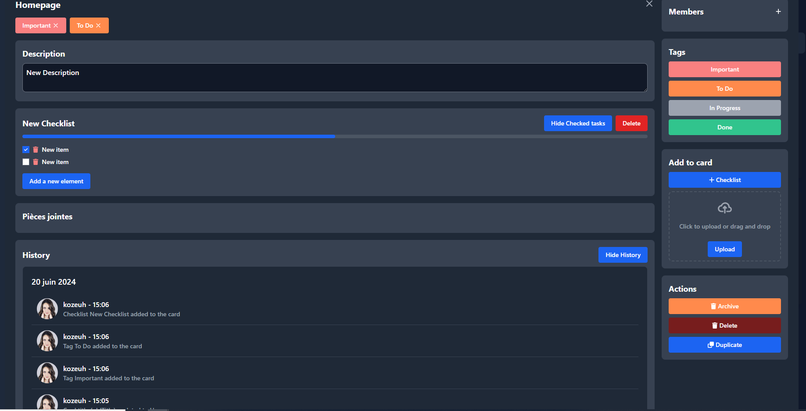

<h1 align="center"> kTrelloc </h1>  

  

  A Trello-like project management tool built with VueJS3, TailwindCSS, Vite 5.0, Express, Prisma, and TypeScript. 
  This project is equipped with a translation system and is available in 6 languages.

  

  

## Table of Contents

- [Introduction](#introduction)
- [Previews](#previews)
- [Features](#features)
- [Feedback](#feedback)
- [Contributors](#contributors)
- [Build Process](#build-process)

## Introduction

kTrello is a Trello-like project management tool built with VueJS3, Express, Prisma, and TypeScript. It allows users to create boards, lists, and cards to organize their tasks and projects.

## Previews

  
<strong>➡️ View</strong>

   
  
  
   
  
  
   
  
  

## Features

A few of the things you can do with kTrelloc :

### Website 🌐

* Create, edit, and delete boards, lists, and cards.
* Add members to boards by defining their roles. (User or Administrator)
* Add comments/checklists/attachments to cards.
* Assign members to cards.
* Add tags to cards.

## Feedback

Feel free to send us feedback -> [file an issue](https://github.com/KoZeuh/kTrelloc-Project-VueJS-ESGI/issues/new). Feature requests are always welcome. If you wish to contribute, please take a quick look at the [guidelines](./CONTRIBUTING.md)!

## Contributors

[@KoZeuh](https://github.com/KoZeuh)

## Build Process

- Clone or download the repository.
- Create a MySQL database named `ktrelloc` with the InnoDB storage engine.
- The database connection is configured in `backend/.env`.

**In the frontend folder:**

- Run `npm install` or `yarn install` to install dependencies.
- Run `npm run dev` or `yarn run dev` to start the user interface in development mode.
  
**In the backend folder:**

- Run `npm install` or `yarn install` to install dependencies.
- Run `npx prisma migrate dev` to perform a database migration.
- Run `npm run dev` or `yarn run dev` to start the server in development mode.

----------------------------------------------------------------------------------------------------------------------------------------------------------------------------------------------------------------------------------------------------------

